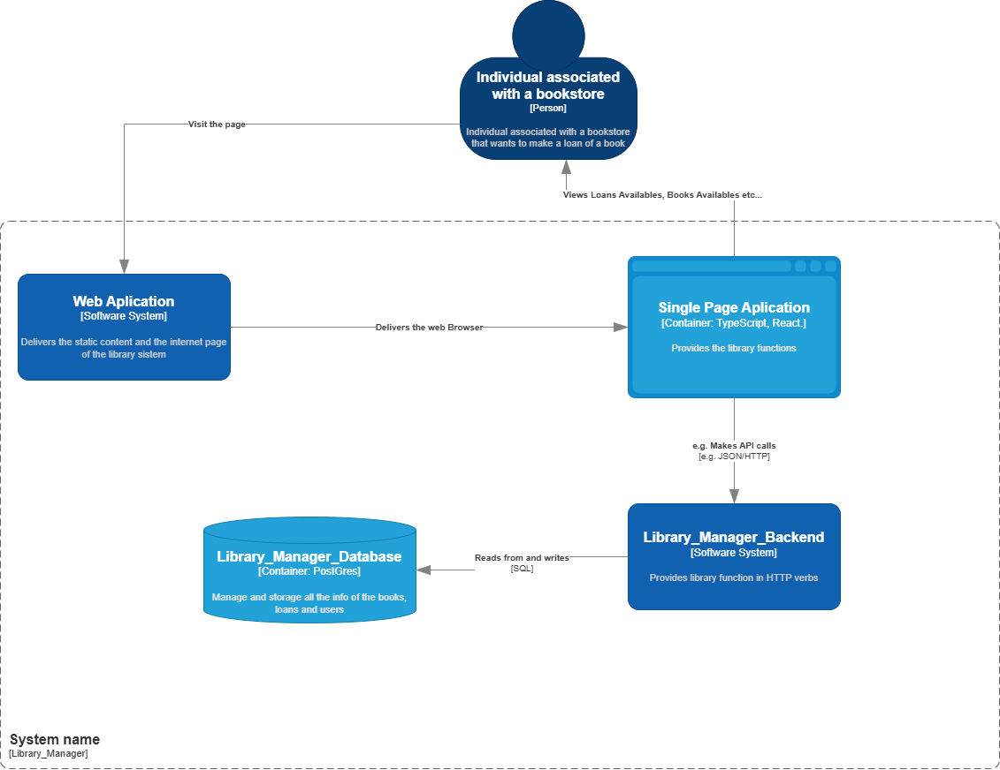
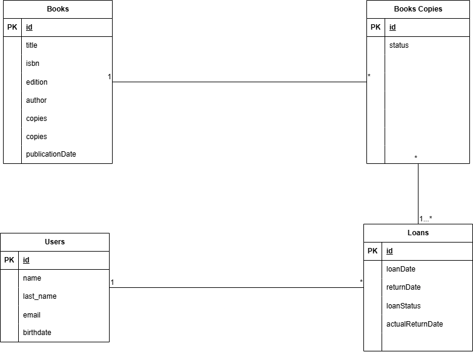

# Library Manager Backend

API REST desarrollada con Spring Boot para la gestión de una biblioteca (libros, copias, usuarios y préstamos).

## Organización del proyecto 

```text
.
├── mvnw / mvnw.cmd
├── pom.xml
├── README.md
├── dump/
├── docs/
├── src/
│   ├── main/
│   │   ├── java/prueba/tecnica/libreria/
│   │   │   ├── config/
│   │   │   ├── controller/
│   │   │   ├── exception/
│   │   │   ├── mapper/
│   │   │   ├── model/
│   │   │   │   ├── dto/
│   │   │   │   │   ├── request/
│   │   │   │   │   └── response/
│   │   │   │   └── entity/
│   │   │   │       └── enums/
│   │   │   ├── repository/
│   │   │   └── service/
│   │   └── resources/
│   └── test/
│       └── java/prueba/tecnica/libreria/
└── target/
```


## Diagrama De Componentes Modelo C4



---

## Diagrama DB


---

## Tecnologías

- Java 17 (compilado con target 17)
- Spring Boot 3.5.4 (Web, Data JPA)
- PostgreSQL
- MapStruct + Lombok
- springdoc-openapi (Swagger UI)
- Docker / Docker Compose

## Ejecución rápida

Requisitos: Docker y Docker Compose.

```bash
git clone https://github.com/JulianLopez11/Library_Manager_Backend.git
cd Library_Manager_Backend
docker compose up -d --build
docker exec -i postgres-biblioteca pg_restore -U prueba -d biblioteca_db --clean --if-exists < dump/biblioteca_db.dump
```


1. Clona el repositorio.
2. Levanta un contenedor `postgres-biblioteca` (PostgreSQL 16) y un contenedor `libreria-app` con la API, esperando a que la base de datos esté saludable antes de arrancar (`healthcheck` + `depends_on: condition: service_healthy`).
3. Restaura los datos de prueba incluidos en el repositorio (ver [Datos de prueba](#datos-de-prueba)).

La API queda disponible en `http://localhost:8080` y el Swagger UI en `http://localhost:8080/swagger-ui/index.html`.

## Variables de entorno

La API se conecta a la base de datos exclusivamente mediante variables de entorno. No hay credenciales ni puertos hardcodeados en el código.

Todas las variables tienen un valor por defecto en `docker-compose.yml`, por lo que el comando anterior funciona sin configuración adicional. Para personalizar puertos o credenciales (por ejemplo, si `8080` o `5432` ya están en uso en el host), copia `.env.example` a `.env` y ajusta los valores:

```bash
cp .env.example .env
```

| Variable            | Descripción                                   | Valor por defecto            |
|---------------------|------------------------------------------------|-------------------------------|
| `APP_PORT`          | Puerto en el host para la API                  | `8080`                        |
| `DB_PORT`           | Puerto en el host para PostgreSQL              | `5432`                        |
| `POSTGRES_DB`       | Nombre de la base de datos                     | `biblioteca_db`               |
| `POSTGRES_USER`     | Usuario de la base de datos                    | `prueba`                      |
| `POSTGRES_PASSWORD` | Contraseña del usuario de la base de datos     | `prueba`                      |

Internamente, el contenedor `app` recibe `DB_URI`, `DB_USER`, `DB_PASSWORD` y `DB_DRIVER` (JDBC), construidos a partir de las variables anteriores.


## Datos de prueba

El directorio [`dump/`](./dump) contiene un backup de PostgreSQL (`biblioteca_db.dump`, formato `custom` de `pg_dump`) con datos de prueba **ya cargados**:

- 4 usuarios (uno de ellos sin préstamos).
- 4 libros con copias físicas registradas.
- 3 préstamos en distintos estados: `PENDING`, `APPROVED` (al día) y `APPROVED` vencido (se resuelve como `OVERDUE` al consultarlo, ya que su fecha de devolución esperada ya pasó).

No es necesario crear ni insertar datos manualmente: el comando de [Ejecución rápida](#ejecución-rápida) ya restaura este dump. Solo debes repetirlo manualmente si necesitas reiniciar el estado de la base de datos en algún momento posterior (por ejemplo, tras reiniciar el contenedor):

```bash
docker exec -i postgres-biblioteca pg_restore -U prueba -d biblioteca_db --clean --if-exists < dump/biblioteca_db.dump
```

`--clean --if-exists` elimina las tablas existentes antes de recrearlas, por lo que el comando es seguro de ejecutar tanto sobre una base de datos recién creada (vacía) como sobre una que ya tenga datos.

## Desarrollo local 


1. Levanta únicamente el servicio de base de datos:

   ```bash
   docker compose up -d db
   ```

2. Si el contenedor `libreria-app` está corriendo, detenlo primero para liberar el puerto `8080`:

   ```bash
   docker stop libreria-app
   ```

3. Exporta las variables de entorno apuntando al Postgres publicado en `localhost:5432` y corre la app:

   **PowerShell**
   ```powershell
   $env:DB_URI = "jdbc:postgresql://localhost:5432/biblioteca_db"
   $env:DB_USER = "prueba"
   $env:DB_PASSWORD = "prueba"
   $env:DB_DRIVER = "org.postgresql.Driver"
   mvn spring-boot:run
   ```

   **bash**
   ```bash
   export DB_URI="jdbc:postgresql://localhost:5432/biblioteca_db"
   export DB_USER="prueba"
   export DB_PASSWORD="prueba"
   export DB_DRIVER="org.postgresql.Driver"
   mvn spring-boot:run
   ```


## Documentación de la API (Swagger)

Una vez la aplicación esté corriendo:

- Swagger UI: `http://localhost:8080/swagger-ui.html`
- OpenAPI docs: `http://localhost:8080/v3/api-docs`

## Endpoints

| Recurso | Endpoint | Función |
|---------|----------|---------|
| Users | `/users` | Crea un usuario nuevo. |
| Users | `/users/{id}` | Actualiza un usuario existente por ID. |
| Users | `/users/{id}` | Elimina un usuario por ID. |
| Users | `/users/{id}` | Obtiene un usuario por ID. |
| Users | `/users/all` | Lista todos los usuarios. |
| Books | `/books` | Crea un libro nuevo. |
| Books | `/books/{id}` | Actualiza un libro existente por ID. |
| Books | `/books/{id}` | Elimina un libro por ID. |
| Books | `/books/{id}` | Obtiene un libro por ID. |
| Books | `/books/all` | Lista todos los libros. |
| Books | `/books/{id}/copies` | Agrega copias físicas a un libro. |
| Books | `/books/isbn/{isbn}/copies/available` | Lista las copias disponibles de un libro por ISBN. |
| Loans | `/loans` | Registra un préstamo para un usuario y un libro. |
| Loans | `/loans/user/{userId}` | Lista los préstamos de un usuario. |
| Loans | `/loans/book/{bookId}` | Lista los préstamos asociados a un libro. |
| Loans | `/loans/{id}/return` | Marca un préstamo como devuelto y libera su copia física. |


## Autor

- [Julian Camilo Lopez Barrero](https://github.com/JulianLopez11)